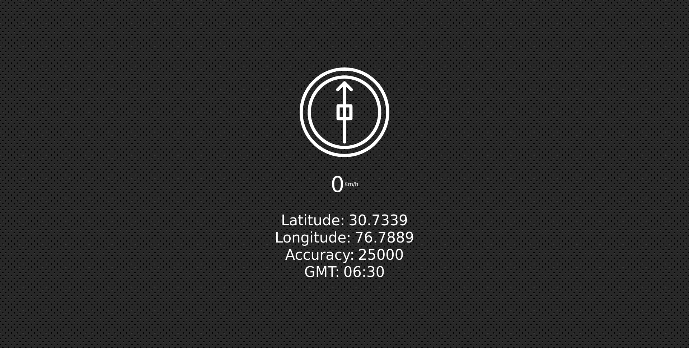

# 21-Geolocation

Date: July 23, 2022

# TwentyFirst challange of [JavaScript30](https://javascript30.com/)

This tell us our geolocation which includes longitude, latitude, accuracy and speed with GMT. Location permission is required for its proper finctioning. To experience on your own visit [here](https://rohit-saini7.github.io/21-Geolocation/).

## What is JavaScript 30

JavaScript 30 is a course taught by Wes Bos. With over 500,000 students, JavaScript 30 is build on the premise that you'll build 30 projects in 30 days. You do need to have an understanding of JavaScript before taking on JavaScript 30.

Learn more about the course in [here](https://javascript30.com/).

## Screenshot

